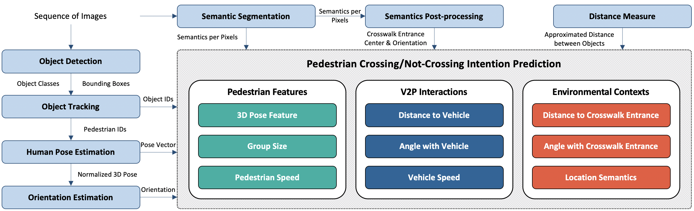
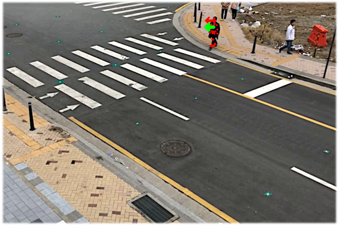
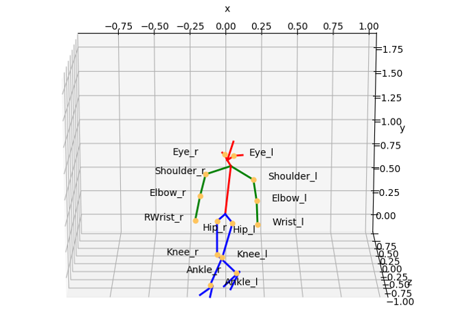
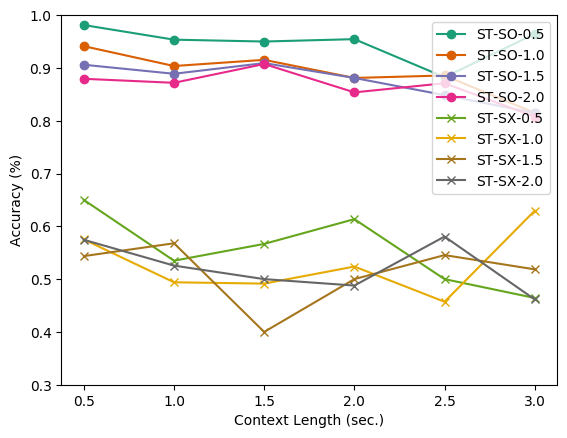
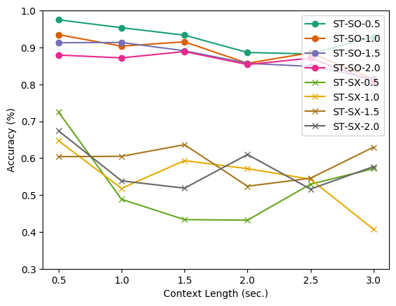
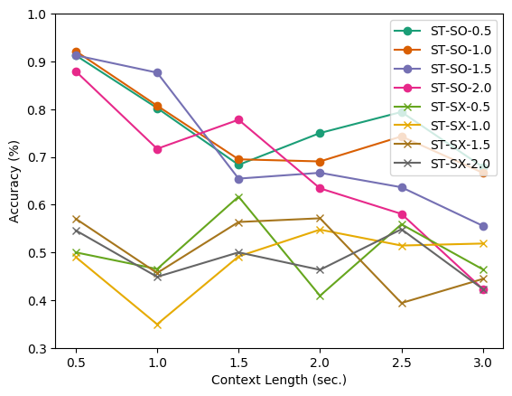
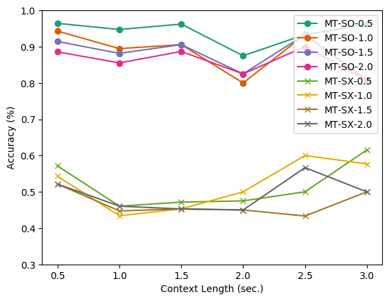
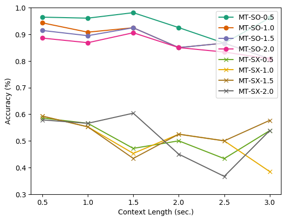
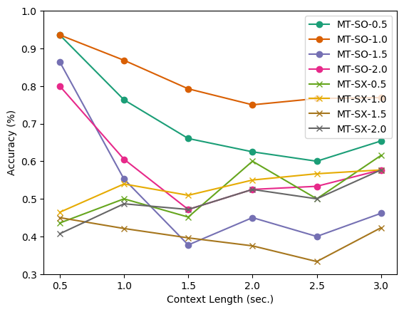

# A Real-time Vision Framework for Pedestrian Behavior Recognition and Intention Prediction at Intersections Using 3D Pose Estimation
[](https://arxiv.org/abs/2009.xxxxx)

We propose a real-time (> 30 FPS) vision framework for two central tasks in intelligent transportation systems:
- Pedestrian Behavior Recognition
- Crossing or Not-Crossing Intention Prediction

Below represents the overall architecture of the proposed vision framework.
<p float="center">
  
</p>

Receiving a sequence of image frames, the proposed framework 1) extracts both 3D and 2D pose of pedestrian of interest in addition to V2P and environment contexts, 2) analyzes the behavior of the pedestrian and 3) predicts the intention of crossing or not-crossing.

<p float="center">
  
  
</p>

Our project includes the following software packages
- [Multi-object tracker](multi_object_tracker/mot.py)
- [Human pose analyzer (projection of 3D pose to 2D imaging planes)](demo_2d_3d_joints.py)
- [Feature (V2P & environmental contexts) extractor](demo_feature_extraction.py)
- [Trainer and tester for intention prediction](intention_prediction/main.py) [(+ raw data)](intention_prediction/data_raw)

> [**A Real-time Vision Framework for Pedestrian Behavior Recognition and Intention Prediction at Intersections Using 3D Pose Estimation**](https://arxiv.org/abs/2009.xxxxx),            
> [Ue-Hwan Kim](https://github.com/Uehwan), [Dongho Ka](https://stslabblog.wordpress.com/people/), [Hwasoo Yea](https://stslabblog.wordpress.com/people/), [Jong-Hwan Kim](http://rit.kaist.ac.kr/home/jhkim/Biography_en),        
> *IEEE Transactions on Intelligent Transportation Systems, Under Review, 2020* 


## Getting Started
We implemented and tested our framework on Ubuntu 18.04 with python >= 3.6. It supports both GPU and CPU inference.

Clone the repo:
```bash
git clone https://github.com/Uehwan/VisionForPedestrian.git
```

Install the requirements using `virtualenv` or `conda`:
```bash
# pip
source scripts/install_pip.sh

# conda
source scripts/install_conda.sh
```

## Running the Demos

### 3D and 2D Pose Estimation: Behavior Analysis
Simply run the following:
```bash
python demo_2d_3d_joints.py
```

### Semantic Segmentation
Simply run the following:
```bash
python demo_semantic_segmentation.py
```

### Multi-Object Tracking and Feature Extraction
Before you extract features for intention prediction, you need to label crosswalk positions by running
```bash
python demo_label_crosswalk.py --root_dir PATH_TO_ROOT
```
The root dir should look like this (this is to support labeling of multiple videos at once; for video to images refer to [this](demo_feature_extraction.py))
```bash
|---- ROOT_DIR
|     |----folder_1
|          |----image_1.jpg
|          |----image_2.jpg
|          |----image_3.jpg
|     |----folder_2
|          |----image_1.jpg
|          |----image_2.jpg
|          |----image_3.jpg
```

In addition, to label the entrance of each crosswalk, click two ends of each crosswalk sequentially. Then, the script will automatically save the labeling result. For example, click cw1-endpoint1 => cw1-endpoint2 => cw2-endpoint1 => cw2-endpoint2 => cw3-endpoint1 => ...

(You can run "demo_crosswalk.py" for the automatic crosswalk detection with tensorflow > 2.1, but the performance is not satisfactory)


Then, run the below and observe the id-lists of same pedestrians.
```bash
python -i demo_feature_extraction.py \
    --vid_file PATH_TO_VIDEO_FILE_TO_ANALYZE \
    --vid_id ID_OF_THE_VIDEO \
    --img_height IMG_HEIGHT \
    --img_width IMG_WIDTH \
    --output_folder DIR_TO_SAVE_RESULTS
```
For example, if the pedestrian id has evolved from 1 to 20 and 25, and another pedestrian id has evolved from 2 to 23, run the following to merge the detection and tracking results.
```bash
>>> update_all_and_save([[1, 20, 25], [2, 23]])
```

### Training and Testing the Performance of Intention Prediction
```bash
# For other configurations, refer to experiment_graph.sh & experiment_table.sh
cd intention_prediction
python main.py \
    --exp_name "GRU_ST_CSO_l2_h32_F05_CL05" \
    --model_type "gru" \
    --num_layers 2 \
    --hidden_size 32 \
    --future_stamps 0.5 \
    --num_output 1 \
    --context_length 0.5
```
You can run the following to retrieve the evaluation results reported in our manuscript.
```bash
python plot_results.py
```
 
## Evaluation Results
<p float="center">
  
  
  
</p>

<p float="center">
  
  
  
</p>


## Citation
If you find this project helpful, please consider citing this project in your publications. The following is the BibTeX of our work.

```bibtex
@inproceedings{kim2020a,
  title={A Real-time Vision Framework for Pedestrian Behavior Recognition and Intention Prediction at Intersections Using 3D Pose Estimation},
  author={Kim Ue-Hwan, Ka Dongho, Yeo Hwasoo, Kim Jong-Hwan},
  journal = {IEEE Transactions on Intelligent Transportation Systems},
  year = {2020}
}
```

## License
This code is available for **non-commercial scientific research purposes**. Third-party datasets and software are subject to their respective licenses.

## Acknowledgments
We base our project on the following repositories:

- 3D Pose Estimation: [VIBE](https://https://github.com/mkocabas/VIBE)
- Multiple People Tracking: [MPT](https://github.com/mkocabas/multi-person-tracker)
- Object Detecctor: [Yolov3](https://github.com/mkocabas/yolov3-pytorch)
- Semantic Segmetation: [HRNetV2](https://github.com/CSAILVision/semantic-segmentation-pytorch)

This work was supported by Institute for Information & communications Technology Promotion (IITP) grant funded by the Korea government (MSIT) (No.2020-0-00440, Development of Artificial Intelligence Technology that Continuously Improves Itself as the Situation Changes in the Real World)
